# TPI — Tribunal de Première Instance

**TPI** signifie **Tribunal de Première Instance**.  
TPI est une application web destinée à aider un **Tribunal de Première Instance** à gérer, centraliser, indexer et rechercher des documents judiciaires au format **PDF**.

L’application permet :
- La centralisation des documents judiciaires
- L’indexation du contenu textuel des PDF
- Le suivi du statut d’extraction
- Une gestion fine des accès selon les **rôles utilisateurs**

---

## 🎯 Objectif du projet

- Centraliser tous les documents PDF judiciaires
- Faciliter la recherche rapide et multicritère
- Suivre le processus d’extraction du texte
- Sécuriser l’accès via rôles et permissions

---

## 📌 Contexte du projet (Stage)

Ce projet a été réalisé dans le cadre d’un **stage au sein d’un tribunal**.  
Il couvre l’ensemble du cycle de développement logiciel :

- Analyse fonctionnelle et recueil des besoins
- Modélisation UML et Merise (MCD)
- Conception UI/UX avec **Figma**
- Développement Backend (Laravel API)
- Développement Frontend (React + Vite)
- Tests fonctionnels et corrections de bugs
- Gestion de projet avec **Jira (Scrum & Kanban)** et planification via **diagramme de Gantt**

---

## 🎨 UI/UX Design — Figma (From scratch)

La conception UI/UX a été réalisée entièrement sur **Figma**, à partir de zéro.

### Étapes suivies :

#### 1. Analyse UX
- Étude du workflow réel du tribunal
- Identification des rôles (Utilisateur / Admin / Super Admin)
- Définition des user flows (authentification, upload, recherche, administration)

#### 2. Wireframes & Maquettes
- Wireframes low-fidelity
- Conversion en maquettes high-fidelity

#### 3. Design System
- Palette de couleurs cohérente
- Typographie uniforme
- Composants réutilisables :
  - Buttons
  - Inputs & Select
  - Tables
  - Modals
  - Badges de statut (pending / processing / done / failed)
- Layout responsive (Sidebar + Header)

Résultat : une interface claire, moderne et adaptée aux utilisateurs du tribunal.

---

## ✨ Fonctionnalités principales

### 🔐 Authentification & Sécurité
- Connexion / Déconnexion
- Consultation du profil (Me)
- Changement de mot de passe
- Mot de passe oublié / Réinitialisation
- Authentification par **Bearer Token (Laravel Sanctum)**

### 📄 Gestion des documents PDF
- Importation de documents PDF
- Stockage des fichiers et métadonnées
- Indexation du contenu textuel
- Suivi du statut d’extraction :
  - `pending`
  - `processing`
  - `done`
  - `failed`
- Recherche multicritère
- Consultation des détails d’un document
- Téléchargement des fichiers PDF

### 🗂️ Référentiels (Lookups)
- Divisions
- Types d’affaires
- Juges

### 👥 Gestion administrative
- Gestion des employés (CRUD utilisateurs)
- Gestion des divisions
- Gestion des types d’affaires
- Gestion des juges
- Tableau de bord (si activé)

---

## 👥 Rôles et permissions

### Utilisateur
- Authentification
- Importation et recherche de documents
- Consultation des détails
- Téléchargement des PDF
- Consultation des référentiels

### Administrateur
- Toutes les permissions utilisateur
- Gestion des employés
- Gestion des divisions
- Gestion des types d’affaires
- Gestion des juges
- Accès au tableau de bord

### Super Administrateur
- Toutes les permissions administrateur
- Activation / désactivation des comptes
- Restrictions :
  - Un administrateur ne peut pas se désactiver lui-même
  - Un administrateur ne peut pas désactiver un Super Admin

---

## 🧱 Technologies utilisées

### Backend
- Laravel (API REST)
- Laravel Sanctum (Personal Access Tokens)
- MySQL
- Stockage local des fichiers PDF
- Queue Worker pour l’extraction du texte

### Frontend
- React.js + Vite
- React Router
- Axios
- Context API (AuthContext)
- Guards de routes (RequireAuth / RequireAdmin)

---

## 🗃️ Base de données (MySQL)

### Tables principales
- `users`
- `documents`
- `divisions`
- `case_types`
- `judges`
- `personal_access_tokens`

### Table `documents` (champs clés)
- `file_path`
- `original_filename`
- `content_text`
- `status`
- `extract_status`
- `extract_error`

---

## 🖼️ Pages de l’application (captures d’écran)

> Assurez-vous que les images existent dans `./docs/screens/`

### 🔐 Page de connexion
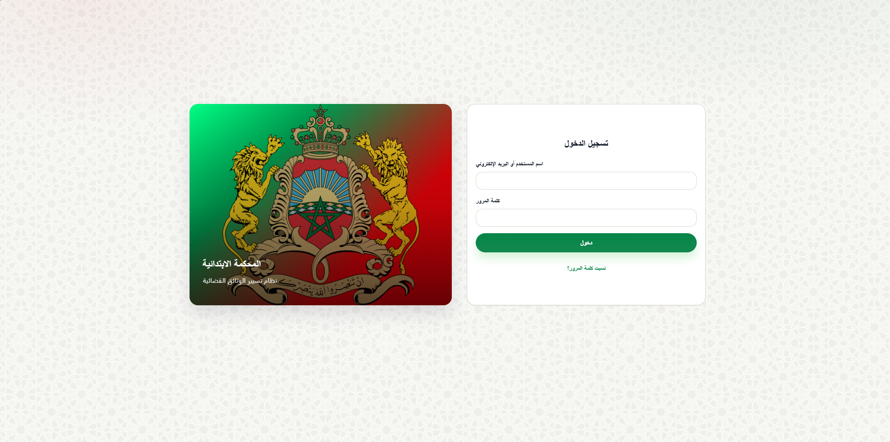

### 🔑 Mot de passe oublié
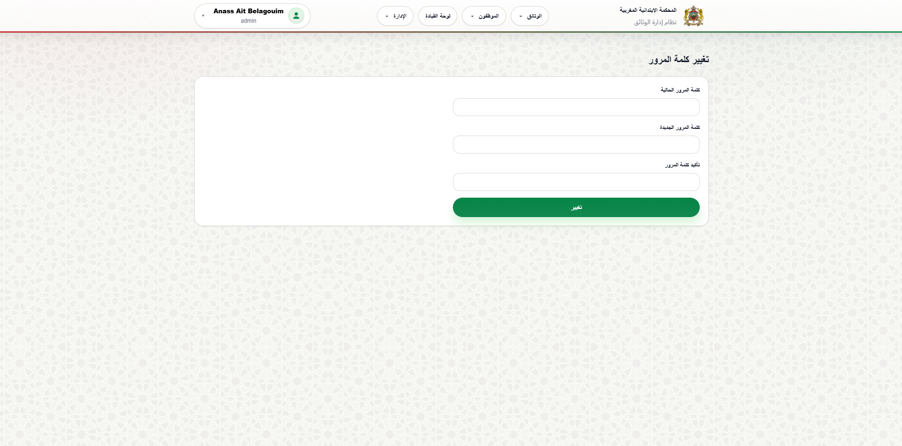

### 📊 Tableau de bord
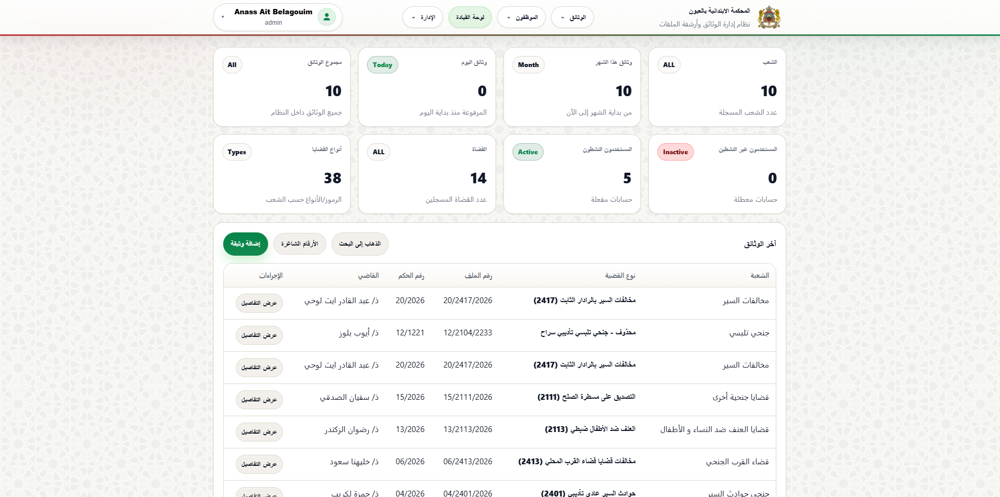

### 🔎 Recherche des documents
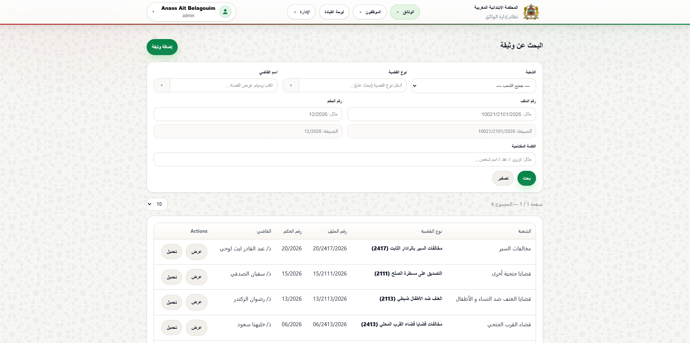

### 📄 Détails d’un document
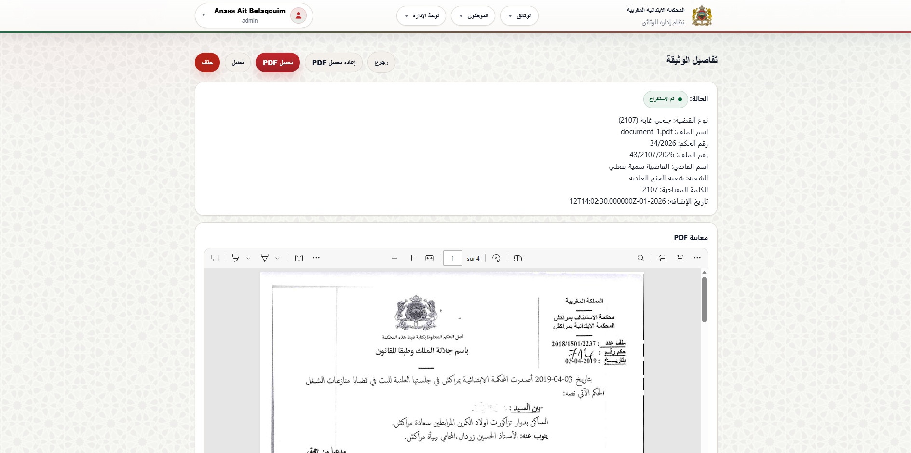

### ⬆️ Ajout d’un document
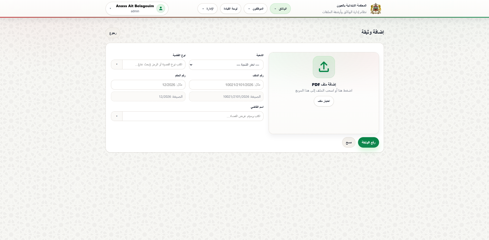

### 👥 Gestion des employés
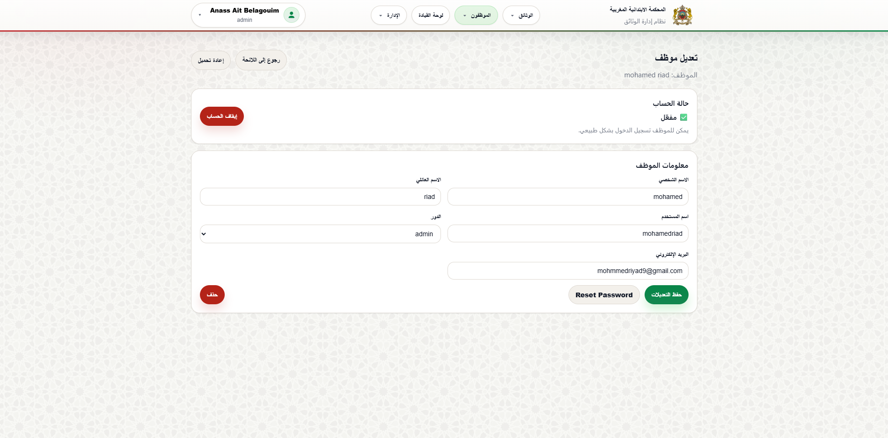

### ➕ Ajout d’un employé
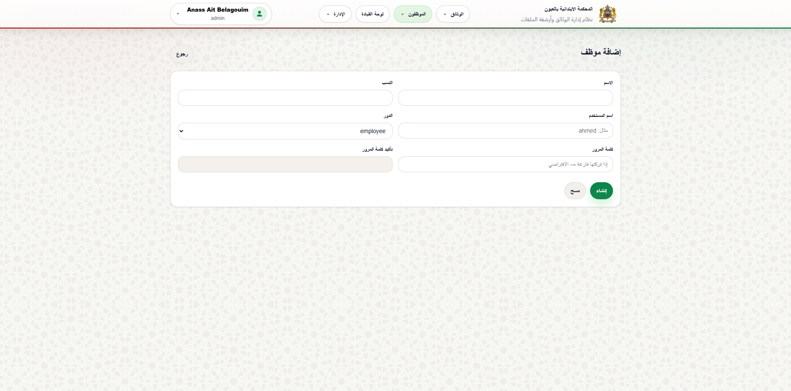

### 🏢 Gestion des divisions
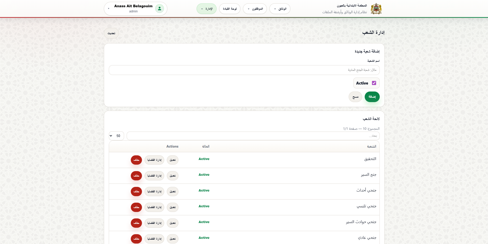

### ⚖️ Gestion des types d’affaires
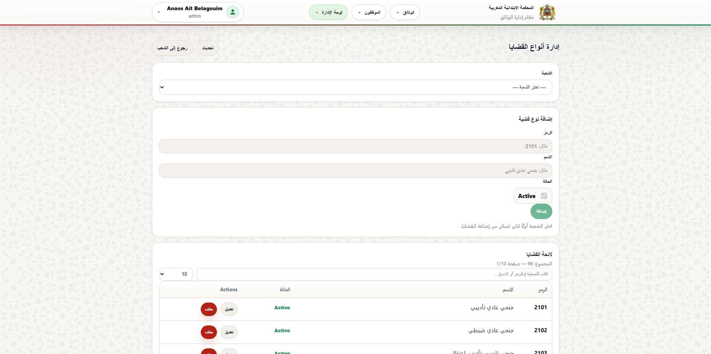

### 👨‍⚖️ Gestion des juges
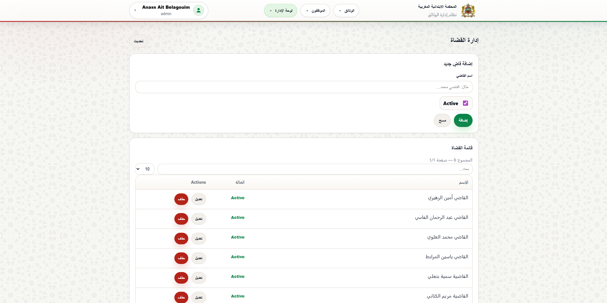

---

## 📅 Gestion du projet

Durée totale : **30 jours**

### Sprint 1 — Analyse & Conception
- Analyse fonctionnelle
- Diagrammes UML
- Modélisation Merise (MCD)
- UI/UX Design (Figma)

### Sprint 2 — Développement
- Backend Laravel API
- Frontend React
- Authentification & gestion des documents

### Sprint 3 — Tests & Documentation
- Tests fonctionnels
- Corrections
- Rédaction du rapport
- Préparation de la soutenance

---

## 📐 Diagrammes réalisés
- Diagramme de cas d’utilisation
- Diagramme de classes
- Diagrammes de séquence
- Diagramme d’état des documents
- Diagramme d’activité
- MCD (Merise)

---

## ⚙️ Installation et configuration (Local)

### ✅ Prérequis
- PHP 8.x
- Composer
- Node.js 18+
- MySQL
- Git

---

## 1️⃣ Backend (Laravel)

```bash
cd backend
composer install
cp .env.example .env
php artisan key:generate

php artisan migrate --seed
php artisan storage:link
php artisan queue:work
php artisan serve --host=0.0.0.0 --port=8000
